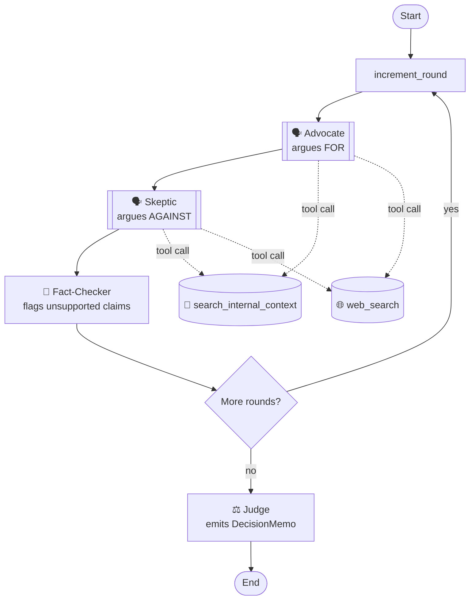

# Should We Build It?

**A multi-agent AI debate arena for product decisions.**

Give it a feature idea — *"Should we add AI-generated summaries to our
note-taking app?"* — and two AI agents argue it out. One makes the case for
building it, the other against. They pull in real evidence as they go, a
third agent fact-checks their claims, and a final judge weighs everything and
hands back a structured go/no-go recommendation.

It's a small, deliberately fun experiment — but a real one. It runs end to end,
and every part of the decision is grounded in evidence you can inspect.

## Quick start

### Option 1: live demo

Check [live version](https://should-we-build-it.onrender.com/).

### Option 2: run it locally

Must have [UV package manager](https://docs.astral.sh/uv/) installed.

Clone the repo and run:

```bash
# Install dependencies
uv sync
# Fill in OPENAI_API_KEY, SERPER_API_KEY
# (LANGSMITH_* is optional, for tracing)                                 
cp .env.example .env
# Run the project                    
uv run uvicorn server.app:app --reload
# Open http://localhost:8000
```

## Why I built this

I'm a product manager, and product managers spend a lot of time on one
question: *is this feature worth building?* The honest answer usually isn't
"yes" or "no" — it's "it depends, and here's what it depends on." I wanted to
see if I could get AI agents to reproduce that kind of reasoning: not just
generate a plausible opinion, but argue both sides from evidence and land on a
genuinely nuanced call.

## How it works

Think of it as a structured debate with four roles:

1. **The Advocate** argues *for* building the feature.
2. **The Skeptic** argues *against* it (or for cutting it down / delaying).
3. **The Fact-Checker** reviews each round and flags any claim that isn't backed
   by real evidence.
4. **The Judge** reads the entire debate and writes the final recommendation.

The debate runs for up to three rounds (configurable when you start one).
Crucially, the Advocate and Skeptic don't just
make things up — before each argument, they **go look things up**. They can
search two kinds of sources:

- **Internal documents** — a mock product spec and a file of real-sounding user
  feedback (the "closed world" of what this company already knows).
- **The live web** — for market data, competitors, or anything the internal docs
  don't cover (the "open world").

Each agent decides *for itself* what it needs to know and goes and finds it. The
Advocate might search the web for market size; the Skeptic might dig into the
internal cost estimates. That "decide, then go get evidence" behavior is what
makes them agents rather than just chatbots.

At the end, the Judge produces a **decision memo**: a recommendation (build /
don't build / build-but-descope), a confidence score, the key tradeoffs, the
specific evidence that *would change the answer*, and open questions to resolve.
That last part — "here's what would change my mind" — is the piece I care about
most, because it's exactly what a good PM writes in a real go/no-go doc.

## What a result looks like

For the note-app summaries question, the system consistently lands on
**"build, but descope"** with moderate confidence — not a coin-flip yes/no. It
recognizes there's real demand from power users, but weighs that against
accuracy risks, uncertain value for the average user, and ongoing costs, and
recommends a narrower first version. The fact-checker catches the debaters when
they overreach — for example, flagging a confident cost figure that the agent
asserted without actually retrieving it.

That nuance is the whole point. A tool that just says "yes, build it!" is
useless. One that says "build a smaller version first, and here's the specific
evidence that would justify going bigger" is the shape of an actual product
decision.

## Design decisions

There's a handful of deliberate choices worth explaining.

**Hybrid grounding: internal docs and live web.** I could have let the agents
argue purely from their own knowledge (fast, but they'd invent things) or only
from a fixed set of documents (safe, but limited). I went with a hybrid: a real
document base for what "the company knows," plus live search for everything
else. It's the setup that best mirrors how a PM actually researches a decision.

**Agents choose their own tools.** Rather than scripting "always search X then
Y," each debater decides when and what to search. This was the harder path to
build, but it's the difference between a genuine agent and a fancy template —
and watching the two agents reach for *different* evidence is the most
convincing part of the demo.

**A fact-checker to keep them honest.** The biggest risk with a debate format is
two AIs generating confident-sounding nonsense. The fact-checker exists to catch
that: it rewards claims backed by retrieved evidence and flags the ones that
aren't. Interestingly, it learned to distinguish *unsupported facts* from
*reasonable opinions* — it flags "this will increase revenue" as speculative but
accepts "users said they'd pay for this" when the evidence is there.

**Structured output, not free text.** The Judge doesn't write a paragraph — it
fills in a strict template (recommendation, confidence, tradeoffs, etc.) that
gets validated automatically. If the AI returns something malformed, it's
rejected at the door rather than breaking the app. Small thing, but it's the
difference between a demo and something you'd trust.

**Built to be watched live.** The debate streams to the browser one step at a
time, so you see the agents work — search, argue, get fact-checked, repeat —
rather than waiting for a finished wall of text. There's even a status line
for the moments in between (fact-checking, preparing the next round) where
nothing would otherwise show for a while.

## What I learned

- **Orchestration is mostly about clean handoffs.** The hard part wasn't any
  single agent — it was defining exactly what information passes between them.
  Once the shared "state" was well-designed, everything else got easier. I built
  and tested each agent in isolation before wiring them together, which saved me
  from debugging five things at once.

- **You have to actually read what the agents do.** My first working version had
  the debaters making the *same argument three times* and running redundant
  searches. I only caught it by reading the execution traces. Watching the
  agents' real behavior — not just the final answer — is where the actual
  improvement happened. (I added observability tooling specifically so I could
  see every search and every decision each agent made.)

- **A model swap turned into a real quality investigation.** Switching to a
  cheaper model for cost reasons silently broke two things — the debaters
  stopped advancing their arguments round over round, and the fact-checker's
  catch rate on unsupported claims collapsed from 40% to 2%. Diagnosing and
  fixing that (reasoning-effort tuning, a fact-checker prompt rewrite, and
  catching a live model reliability bug along the way) is written up in full
  in [`docs/model-migration-quality-investigation.md`](docs/model-migration-quality-investigation.md)
  — probably the most rigorous piece of debugging in this whole project.

- **Guardrails matter more than cleverness.** Left unconstrained, the agents
  would over-search and repeat themselves. A couple of simple limits — cap the
  searches per turn, tell each agent not to repeat its earlier points — did more
  for quality than any prompt wizardry.

- **"What would change my mind" is the killer feature.** Getting the Judge to
  name the *specific missing evidence* that would flip its recommendation turned
  the output from a generic verdict into something that reads like a real
  decision doc. It's a small prompt design choice with an outsized effect.

- **The messy-honest result is the good result.** I designed the test scenario
  to have genuine tension (real demand, real risks), and the system landing on
  "build a smaller version" instead of a clean yes/no is the thing I'm proudest
  of. It shows the setup produces judgment, not just an answer.

## Under the hood

- **[LangGraph](https://www.langchain.com/langgraph)** runs the whole thing as a
  state machine — each agent is a node, and a looping structure runs the
  configured number of debate rounds before handing off to the judge. (The round loop is a genuine
  cycle in the graph, which is the main reason I chose a graph framework over a
  simple linear chain.)
- **OpenAI** models power the agents, using native tool-calling so each agent
  decides its own searches.
- **[Serper](https://serper.dev)** for live web search; **Chroma** for searching
  the internal documents.
- **[LangSmith](https://www.langchain.com/langsmith)** for tracing — every agent
  step, search, and decision is captured as an inspectable tree. This is what let
  me spot the redundant-search and repetition issues.
- **FastAPI** serves the app and streams the debate to the browser (per-node,
  over Server-Sent Events).
- **[uv](https://github.com/astral-sh/uv)** for environment and dependency
  management.

### The graph



The double-bordered nodes are the two debaters, each running its own
tool-calling loop underneath (dashed lines) before handing off — the
solid edges are the actual LangGraph state machine; the dashed ones aren't
graph edges at all, just each agent reaching for evidence mid-turn.

## Honest limitations

This is an experiment, not a product. A few things I'd flag:

- The fact-checker judges claims against what the agent *retrieved that round*,
  so a true fact stated without a matching search can still get flagged. That's
  intentional (it rewards citing your sources) but it's a simplification.
- Debate quality depends on the quality of the internal documents. Vague inputs
  produce vague debates.
- The example scenario got by far the most testing and tuning attention; other
  questions should work fine (nothing in the prompts is hardcoded to it) but
  haven't been stress-tested nearly as hard.
- The underlying model occasionally emits malformed output — an unexecuted
  tool-call attempt, or its own reasoning narration, leaking into the visible
  argument as raw text. I added detection, a retry, and defensive cleanup so
  it never reaches the UI, but it's a real, intermittent thing the model does,
  not something I can fully prevent from the app side.
- Rate limiting is in-memory and single-process — right for a low-traffic solo
  deployment, not a real multi-instance solution.
- The agents run on general models with no fine-tuning — this is orchestration,
  not model training.
